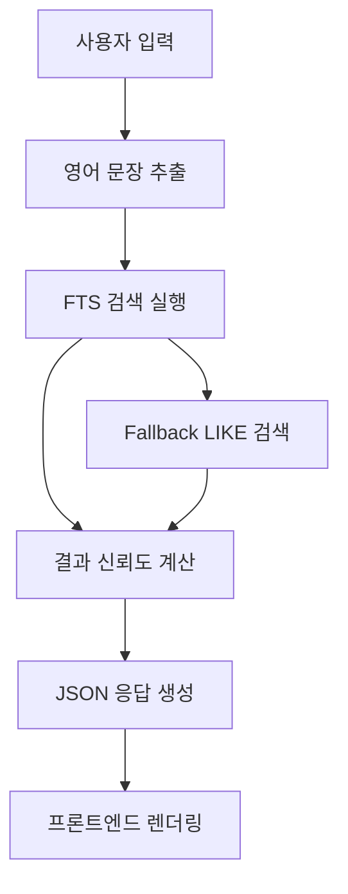
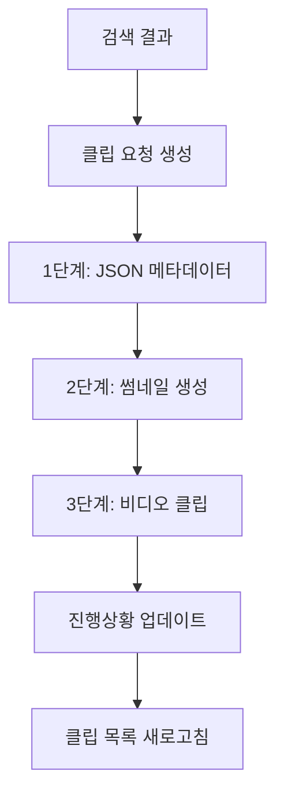
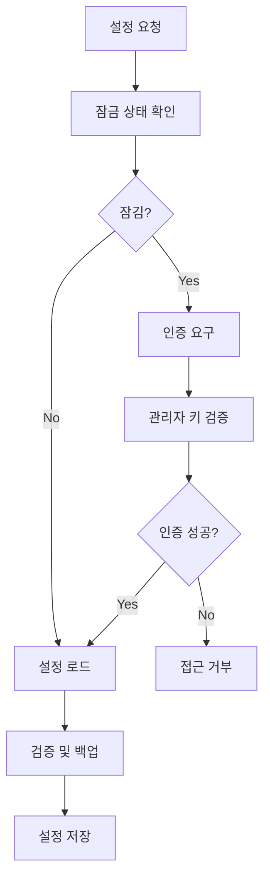

# 🏗️ Theme Search - 핵심 시스템 아키텍처

> **🎯 선임 개발자를 위한 기술적 상세 가이드**

## 📋 목차
1. [시스템 개요](#시스템-개요)
2. [핵심 로직 분석](#핵심-로직-분석)
3. [데이터 플로우](#데이터-플로우)
4. [API 아키텍처](#api-아키텍처)
5. [보안 시스템](#보안-시스템)
6. [성능 최적화](#성능-최적화)
7. [확장 가능성](#확장-가능성)

---

## 🏛️ 시스템 개요

### 기술 스택
```typescript
Frontend: Next.js 15.3.3 + TypeScript + Tailwind CSS
Backend: Next.js API Routes (Server-side)
Database: SQLite (better-sqlite3) + FTS (Full-Text Search)
Video: FFmpeg (클립 생성 및 썸네일)
Deployment: Vercel (프론트엔드) + Node.js (백엔드)
```

### 아키텍처 패턴
- **풀스택 모노리스**: Next.js로 프론트엔드와 백엔드 통합
- **RESTful API**: 명확한 엔드포인트 구조
- **파일 기반 라우팅**: Next.js App Router 활용
- **서버사이드 렌더링**: 검색 결과 페이지 최적화

---

## 🔧 핵심 로직 분석

### 1. 🔍 검색 엔진 (`batch-search/route.ts`)

#### 영어 문장 추출 로직
```typescript
function extractEnglishSentences(text: string): string[] {
  // 1. 한글/중국어/일본어 문자 제거
  const koreanRegex = /[\u1100-\u11FF\u3130-\u318F\uAC00-\uD7AF\u4E00-\u9FFF\u3040-\u309F\u30A0-\u30FF]/g;
  
  // 2. 줄바꿈 기준 분리 + 필터링
  const lines = text.split('\n').map(line => line.trim()).filter(line => {
    if (line.length === 0) return false;
    if (koreanRegex.test(line)) return false;
    if (line.length < 3) return false;
    if (line.split(/\s+/).length < 2) return false;
    return true;
  });
  
  return lines;
}
```

#### SQLite FTS 검색 최적화
```typescript
function searchInDatabase(query: string, limit: number): SearchResult[] {
  try {
    // Primary: FTS5 검색 (성능 우선)
    const stmt = database.prepare(`
      SELECT s.media_file, s.text, s.start_time, s.end_time, s.language, s.directory,
             rank
      FROM subtitles_fts fts
      JOIN subtitles s ON s.id = fts.rowid
      WHERE fts.text MATCH ?
      ORDER BY rank
      LIMIT ?
    `);
    
    const results = stmt.all(query, limit);
    return results.map((row: any, index: number) => ({
      // ...매핑 로직
      confidence: Math.max(0.7, Math.min(1.0, 1.0 - (index * 0.05)))
    }));

  } catch (error) {
    // Fallback: LIKE 검색
    const stmt = database.prepare(`
      SELECT media_file, text, start_time, end_time, language, directory
      FROM subtitles 
      WHERE text LIKE ? COLLATE NOCASE
      ORDER BY media_file, start_time
      LIMIT ?
    `);
    
    return stmt.all(`%${query}%`, limit);
  }
}
```

### 2. 🎬 클립 생성 파이프라인 (`auto-clips/route.ts`)

#### 3단계 배치 처리
```typescript
// 단계 1: JSON 메타데이터 생성
async function createMetadataFiles(clips: ClipRequest[]): Promise<void> {
  for (const clip of clips) {
    const metadata = {
      id: generateUniqueId(),
      title: clip.title,
      sentence: clip.sentence,
      // ...기타 메타데이터
    };
    
    await fs.writeFile(
      path.join(clipsDir, `${metadata.id}.json`),
      JSON.stringify(metadata, null, 2)
    );
  }
}

// 단계 2: 썸네일 생성 (FFmpeg)
async function generateThumbnails(clips: ClipRequest[]): Promise<void> {
  const commands = clips.map(clip => {
    const timeSeconds = parseTimeToSeconds(clip.startTime) + 1; // 1초 후 캡처
    return `ffmpeg -i "${clip.sourceFile}" -ss ${timeSeconds} ` +
           `-vf "scale=320:180,brightness=${brightness},contrast=${contrast}" ` +
           `-q:v ${quality} -frames:v 1 "${clip.thumbnailPath}"`;
  });
  
  await Promise.allSettled(commands.map(cmd => exec(cmd)));
}

// 단계 3: 비디오 클립 생성 (FFmpeg)
async function generateVideoClips(clips: ClipRequest[]): Promise<void> {
  const commands = clips.map(clip => {
    const startTime = adjustTime(clip.startTime, -paddingSeconds);
    const duration = calculateDuration(clip.startTime, clip.endTime, paddingSeconds);
    
    return `ffmpeg -i "${clip.sourceFile}" -ss ${startTime} -t ${duration} ` +
           `-c:v ${videoCodec} -c:a ${audioCodec} -avoid_negative_ts make_zero ` +
           `"${clip.outputPath}"`;
  });
  
  await Promise.allSettled(commands.map(cmd => exec(cmd)));
}
```

### 3. ⚙️ 안전한 설정 관리 (`config-manager.ts`)

#### 계층적 설정 시스템
```typescript
// 기본 설정 (코드 레벨)
const DEFAULT_CONFIG = {
  mediaConfig: { /* 기본값들 */ },
  searchConfig: { /* 기본값들 */ }
};

// 사용자 설정 (파일 레벨)
const USER_SETTINGS_PATH = 'config/user-settings.json';

// 최종 병합된 설정
function getConfig(): Config {
  const userSettings = loadUserSettings();
  return deepMerge(DEFAULT_CONFIG, userSettings);
}
```

#### 설정 검증 및 안전장치
```typescript
function validateConfigStructure(config: any): boolean {
  // 1. 구조 검증
  if (!config.mediaConfig || !config.searchConfig) {
    return false;
  }

  // 2. 값 범위 검증
  const ffmpeg = config.mediaConfig.FFMPEG_SETTINGS;
  if (ffmpeg.THUMBNAIL_QUALITY < 1 || ffmpeg.THUMBNAIL_QUALITY > 5) {
    return false;
  }

  // 3. 타입 검증
  for (const [key, expectedType] of Object.entries(CONFIG_SCHEMA)) {
    if (typeof config[key] !== expectedType) {
      return false;
    }
  }

  return true;
}

function createBackup(): boolean {
  try {
    const timestamp = new Date().toISOString().replace(/[:.]/g, '-');
    const backupPath = `${USER_SETTINGS_PATH}.backup.${timestamp}`;
    fs.copyFileSync(USER_SETTINGS_PATH, backupPath);
    return true;
  } catch (error) {
    return false;
  }
}
```

---

## 🌊 데이터 플로우

### 검색 요청 플로우


### 클립 생성 플로우


### 설정 관리 플로우


---

## 🔌 API 아키텍처

### 엔드포인트 구조
```typescript
/api/
├── batch-search/        # POST: 다중 문장 검색
│   └── route.ts
├── auto-clips/          # POST: 자동 클립 생성
│   └── route.ts  
├── clips/              # GET: 클립 목록, POST: 단일 클립 생성
│   ├── route.ts
│   └── [id]/
│       └── route.ts     # DELETE: 클립 삭제
└── settings/           # GET/POST/PUT/PATCH: 설정 관리
    └── route.ts
```

### API 응답 패턴
```typescript
// 성공 응답
interface SuccessResponse<T> {
  success: true;
  data: T;
  message?: string;
}

// 실패 응답
interface ErrorResponse {
  success: false;
  error: string;
  code?: string;
}

// 검색 응답
interface SearchResponse {
  success: true;
  extracted_sentences: string[];
  search_summary: {
    total_sentences: number;
    total_results: number;
    average_per_sentence: string;
    search_time: number;
  };
  sentence_results: SentenceResult[];
  auto_create_clips: boolean;
}
```

### 에러 핸들링 패턴
```typescript
try {
  // 비즈니스 로직
  const result = await processRequest(data);
  return NextResponse.json({ success: true, data: result });
  
} catch (error) {
  console.error('API 오류:', error);
  
  if (error instanceof ValidationError) {
    return NextResponse.json(
      { success: false, error: error.message },
      { status: 400 }
    );
  }
  
  return NextResponse.json(
    { success: false, error: '서버 내부 오류' },
    { status: 500 }
  );
}
```

---

## 🔐 보안 시스템

### AI 방지 설정 잠금
```typescript
// 잠금 파일 기반 보안
const LOCK_FILE = '.settings.lock';

function isSettingsLocked(): boolean {
  return fs.existsSync(LOCK_FILE);
}

function lockSettings(): void {
  fs.writeFileSync(LOCK_FILE, new Date().toISOString());
}

function unlockSettings(adminKey: string): boolean {
  if (adminKey !== process.env.ADMIN_UNLOCK_KEY) {
    return false;
  }
  
  try {
    fs.unlinkSync(LOCK_FILE);
    return true;
  } catch {
    return false;
  }
}
```

### 입력 검증 및 새니타이제이션
```typescript
function sanitizeInput(input: string): string {
  return input
    .replace(/[<>\"']/g, '') // XSS 방지
    .replace(/\0/g, '')      // NULL 바이트 제거
    .trim()
    .substring(0, 1000);     // 길이 제한
}

function validateSearchQuery(query: string): boolean {
  if (!query || query.length < 2) return false;
  if (query.length > 1000) return false;
  if (/[<>\"']/.test(query)) return false;
  return true;
}
```

### 파일 경로 보안
```typescript
function sanitizePath(userPath: string): string {
  return path.resolve(
    path.join(SAFE_ROOT_DIR, path.normalize(userPath))
  ).replace(/\.\./g, ''); // 디렉토리 트래버설 방지
}
```

---

## ⚡ 성능 최적화

### 데이터베이스 최적화
```sql
-- FTS5 인덱스 활용
CREATE VIRTUAL TABLE subtitles_fts USING fts5(
  text,
  content='subtitles',
  content_rowid='id'
);

-- 복합 인덱스
CREATE INDEX idx_media_time ON subtitles(media_file, start_time);
CREATE INDEX idx_language ON subtitles(language);
```

### 클립 생성 최적화
```typescript
// 배치 처리로 FFmpeg 호출 최소화
const BATCH_SIZE = 20;

async function processBatch<T>(
  items: T[],
  processor: (batch: T[]) => Promise<void>
): Promise<void> {
  for (let i = 0; i < items.length; i += BATCH_SIZE) {
    const batch = items.slice(i, i + BATCH_SIZE);
    await processor(batch);
  }
}
```

### 프론트엔드 최적화
```typescript
// 1. 실시간 업데이트 (클립 생성 진행상황)
useEffect(() => {
  const interval = setInterval(() => {
    if (autoClipProgress.isCreating) {
      loadClips(); // 2초마다 새로고침
    }
  }, 2000);
  
  return () => clearInterval(interval);
}, [autoClipProgress.isCreating]);

// 2. 조건부 렌더링 (불필요한 리렌더링 방지)
const ClipCard = memo(({ clip }: { clip: ClipMetadata }) => {
  return <div>{/* 클립 UI */}</div>;
});

// 3. 지연 로딩 (클립 목록)
const [clips, setClips] = useState<ClipMetadata[]>([]);
const [isLoading, setIsLoading] = useState(false);
```

---

## 🔧 확장 가능성

### 1. 다중 데이터베이스 지원
```typescript
interface DatabaseAdapter {
  search(query: string, limit: number): Promise<SearchResult[]>;
  connect(): Promise<void>;
  disconnect(): Promise<void>;
}

class SQLiteAdapter implements DatabaseAdapter {
  // SQLite 구현
}

class PostgreSQLAdapter implements DatabaseAdapter {
  // PostgreSQL 구현
}
```

### 2. 플러그인 시스템
```typescript
interface ClipProcessor {
  process(clip: ClipRequest): Promise<ProcessedClip>;
  supports(format: string): boolean;
}

class FFmpegProcessor implements ClipProcessor {
  // FFmpeg 기반 처리
}

class WebAssemblyProcessor implements ClipProcessor {
  // 브라우저 기반 처리
}
```

### 3. 마이크로서비스 분리
```typescript
// 현재: 모노리스
app/api/batch-search/route.ts
app/api/auto-clips/route.ts

// 미래: 마이크로서비스
search-service/
├── src/
├── Dockerfile
└── package.json

clip-service/
├── src/
├── Dockerfile
└── package.json
```

### 4. 캐싱 시스템
```typescript
// Redis 캐싱 (향후)
interface CacheService {
  get(key: string): Promise<any>;
  set(key: string, value: any, ttl?: number): Promise<void>;
  del(key: string): Promise<void>;
}

// 검색 결과 캐싱
const cacheKey = `search:${hashQuery(query)}`;
const cached = await cache.get(cacheKey);
if (cached) {
  return cached;
}

const results = await searchDatabase(query);
await cache.set(cacheKey, results, 300); // 5분 캐시
```

---

## 🧪 테스트 전략

### 단위 테스트 (Jest)
```typescript
describe('extractEnglishSentences', () => {
  test('should extract valid English sentences', () => {
    const input = 'Hello world\n안녕하세요\nHow are you?';
    const result = extractEnglishSentences(input);
    expect(result).toEqual(['Hello world', 'How are you?']);
  });
});

describe('validateConfigStructure', () => {
  test('should validate correct config structure', () => {
    const config = { mediaConfig: {}, searchConfig: {} };
    expect(validateConfigStructure(config)).toBe(true);
  });
});
```

### 통합 테스트
```typescript
describe('Batch Search API', () => {
  test('should return search results', async () => {
    const response = await fetch('/api/batch-search', {
      method: 'POST',
      body: JSON.stringify({ text: 'Hello world', results_per_sentence: 5 })
    });
    
    const data = await response.json();
    expect(data.success).toBe(true);
    expect(data.sentence_results).toBeDefined();
  });
});
```

### E2E 테스트 (Playwright)
```typescript
test('complete search and clip creation flow', async ({ page }) => {
  await page.goto('/');
  await page.fill('[data-testid="search-input"]', 'Hello world');
  await page.click('[data-testid="search-button"]');
  
  await expect(page.locator('[data-testid="results"]')).toBeVisible();
  await page.click('[data-testid="create-clip"]');
  
  await expect(page.locator('[data-testid="clip-created"]')).toBeVisible();
});
```

---

## 🚀 배포 및 DevOps

### Docker 컨테이너화
```dockerfile
FROM node:18-alpine

WORKDIR /app
COPY package*.json ./
RUN npm ci --only=production

COPY . .
RUN npm run build

EXPOSE 3000
CMD ["npm", "start"]
```

### 환경별 설정
```typescript
// development
const config = {
  database: 'public/working_subtitles.db',
  media_path: '/mnt/qnap/media_eng',
  log_level: 'debug'
};

// production
const config = {
  database: process.env.DATABASE_URL,
  media_path: process.env.MEDIA_PATH,
  log_level: 'info'
};
```

### 모니터링 및 로깅
```typescript
// 구조화된 로깅
const logger = {
  info: (message: string, meta?: object) => {
    console.log(JSON.stringify({
      level: 'info',
      message,
      timestamp: new Date().toISOString(),
      ...meta
    }));
  },
  
  error: (message: string, error?: Error, meta?: object) => {
    console.error(JSON.stringify({
      level: 'error',
      message,
      error: error?.stack,
      timestamp: new Date().toISOString(),
      ...meta
    }));
  }
};
```

---

## 📊 성능 메트릭

### 핵심 지표
- **검색 응답 시간**: < 500ms (FTS 기준)
- **클립 생성 시간**: 평균 3초/클립 (FFmpeg)
- **동시 사용자**: 최대 10명 (현재 구조)
- **저장소 효율**: 클립당 평균 2MB

### 병목 지점
1. **FFmpeg 처리**: CPU 집약적 작업
2. **파일 I/O**: 대용량 비디오 파일 접근
3. **SQLite 동시성**: 단일 Writer 제한

### 최적화 기회
1. **클립 생성 큐**: 백그라운드 작업 시스템
2. **CDN 활용**: 정적 파일 배포
3. **데이터베이스 샤딩**: 대용량 데이터 처리

---

> **📝 이 문서는 시스템의 핵심 로직과 아키텍처를 다룹니다. 실제 구현 시 최신 코드를 참조하세요.**
